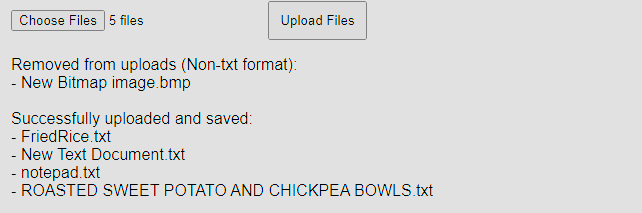

# RAG-application-using-LlamaIndex
RAG Implementation using FastAPI and LLamaIndex


# Requirements

To run this project, you need to install its dependencies. You can do so by using the following pip command in your terminal:

```bash
pip install -r requirements.txt
```

Alternatively, if you prefer to use a virtual environment, a setup is included in the `userenv` folder. You can activate this environment to manage dependencies separately from your global Python installation.

## Running the Application

### Setting up the Server

1. Open a command prompt.
2. Change directory to where your `.py` file is located using:
   ```bash
   cd path_to_your_directory
   ```
3. Run the application with:
   ```bash
   uvicorn main:app
   ```
   If you encounter an error saying `'uvicorn' is not recognized as an internal or external command`, run the server using:
   ```bash
   python -m uvicorn main:app
   ```

### Using the Main Interface

Access the web interface by navigating to the localhost server main endpoint, which is shown after succesfully starting up uvicorn through the command, an example is shown as image below:

From here, you can access the functionalities for file upload and querying:

#### File Upload

- Use the 'Choose File' button in the main interface to select one or multiple files you wish to upload.
- Click 'Upload Files' to submit the files.
- Files will be uploaded, ingested, and saved in both a 'data' folder and indexed in llama index through the **POST `/ingest`** endpoint
- The result of the upload will be displayed once the process is completed.


### Query from File
#### Through main interface
- Type your query into the message textbox and click the 'Send' button.
- The query will be sent to **GET `/query`** endpoint and generate a response
- The input and response text will be displayed in the message box.


#### Through endpint directly
- While the server is running in the background, navigate to your browser and type the following in the address bar: **{Server URL and port}/query?query="{Insert Your Query here}"**

An example would be **ht<span>tp<span>://127.0.0.1:8000/query?query="How many eggs for a fried rice"**

A response will be given in JSON format: {"query":{Your Query text},"results":{Response Generated}}
